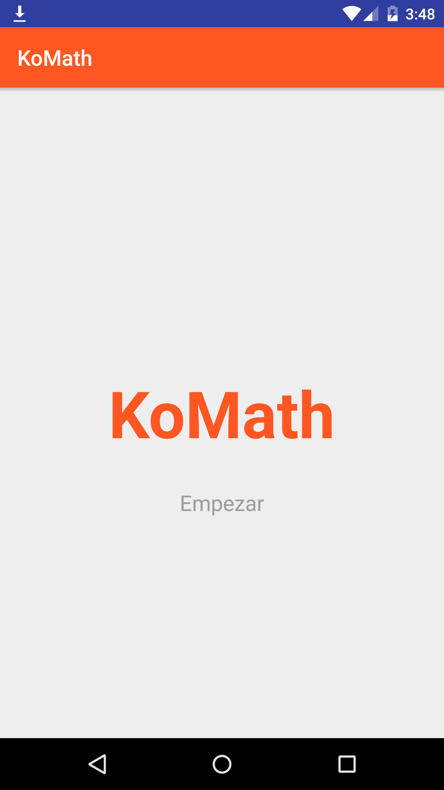
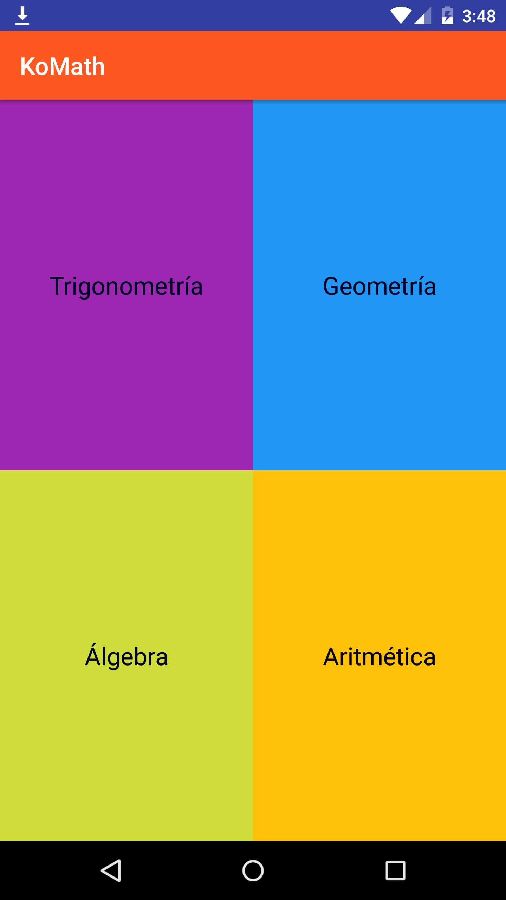
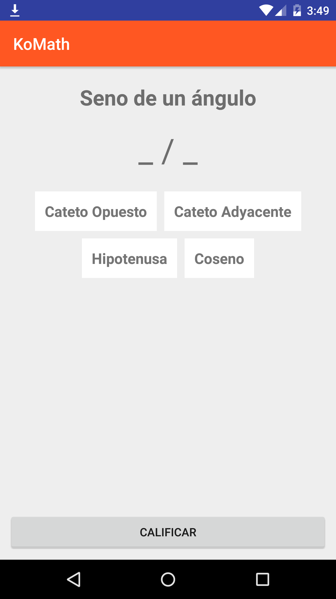
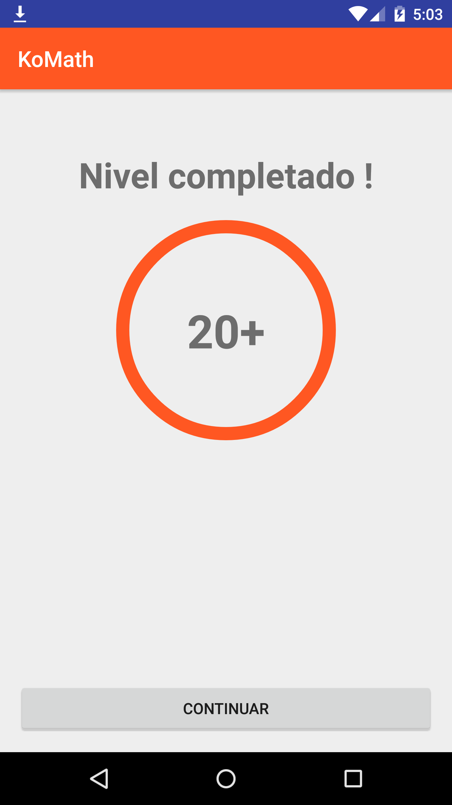

# KoMath[Coming soon]

## KoMath 

Aplicación Android desarrollada en Kotlin, que te permite aprender fórmulas matemáticas.

## Guía 

- Guía práctica para la construir una aplicación Android usando Kotlin [https://github.com/emedinaa/KoMath/blob/master/GUIDE.md](https://github.com/emedinaa/KoMath/blob/master/GUIDE.md)

## Dependencias

- Retrofit 2.1.0

- Retrofit Converter-Gson 2.1.0 

## Issues

## Google Play
